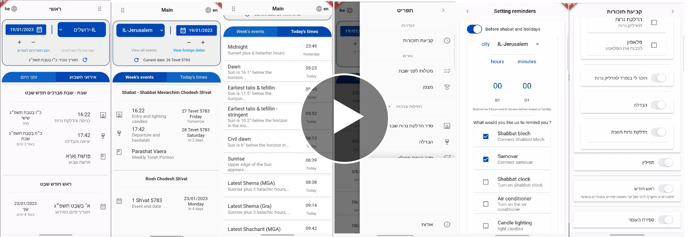

# Kodesh :candle::candle:

## 2023 - Kodesh – IOS/ Android smartphone application.

The application developed to help its users who want to know the entry and exit times of Shabbats and Jewish holidays, Jewish times of the day, and more by logging in or by receiving notifications as the users wish.
It is also possible to set notifications for additional reminders, for example, reminders to put on tefillin.

---

### Technologies:

  

### Programming Languages:

  

---

## In the app you will find:

#### • Display in different languages.

### • Using three different APIs:

1. [Hebcal Shabbat Times REST API](https://www.hebcal.com/home/197/shabbat-times-rest-api).
2. [Hebcal Zmanim API](https://www.hebcal.com/home/1663/zmanim-halachic-times-api).
3. [Hebcal Hebrew Date Converter REST API](https://www.hebcal.com/home/219/hebrew-date-converter-rest-api).

#### • Reminders - using local notifications:

1. Before Shabat and holidays:

- A reminder to connect Shabat blech, samovar, Shabat clock and more.
- A seperate reminder to light candles.
- A reminder for havdalah.

2. Hanukkah candles lighting.
3. Teffilin (phylacteries) reminder.
4. Rosh Chodesh (the first day of the month).
5. Counting of the Omer.

#### • Several different prayers that are opened according to the notification.

#### • Prayer compass.

#### • Animations.
