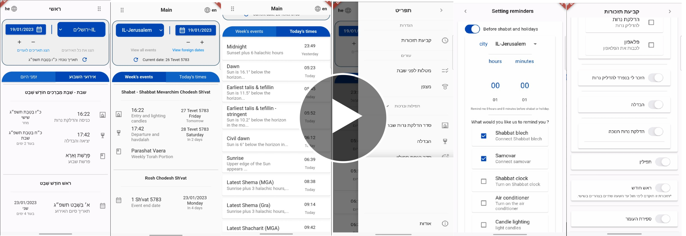

# Kodesh :candle::candle:

## 2023 - Kodesh – iOS / Android smartphone application.

The application helps users know the entry and exit times of Shabbat and Jewish holidays, halachic times of day (zmanim), and more. It also supports local push notifications for various Jewish observances and includes prayer texts and a Qibla compass.

<a href='https://vimeo.com/790796748'>
  
</a>

---

### Technologies

<div>
  
  
</div>

---

## Features

- **Shabbat & holiday times** — weekly candle-lighting and Havdalah times powered by the Hebcal API
- **Zmanim** — daily halachic times (Shacharit, Mincha, sunset, etc.)
- **Local push notifications** for:
  - Shabbat/holiday preparation (blech, samovar, Shabbat clock, candle lighting, Havdalah)
  - Hanukkah candle lighting
  - Tefillin (phylacteries) daily reminder
  - Rosh Chodesh
  - Sefirat HaOmer (counting of the Omer)
- **Prayer texts** — multiple nusachim (Ashkenaz, Sfarad, Mizrachi)
- **Qibla compass**
- **Multi-language UI** — English, Hebrew, Spanish, Russian
- **Offline support** — last-fetched events cached locally

---

## Developer Setup

### Prerequisites

- [Flutter SDK](https://docs.flutter.dev/get-started/install) (stable channel, ≥ 3.0)
- Android Studio or Xcode (for device/emulator)
- A connected device or running emulator

### Install dependencies

```bash
flutter pub get
```

### Run on a device or emulator

```bash
flutter run
```

### Regenerate localization files

Run this after editing any `.arb` file in `lib/api/l10n/`:

```bash
flutter gen-l10n
```

Generated files are written to `.dart_tool/flutter_gen/gen_l10n/` and are not committed to the repository.

---

## Building

### Android

```bash
flutter build apk            # debug APK
flutter build apk --release  # release APK
flutter build appbundle      # Android App Bundle for Play Store
```

### iOS

```bash
flutter build ios            # requires macOS + Xcode
```

---

## Testing & Code Quality

```bash
flutter test                          # run all tests
flutter test test/unit/               # unit tests only (with coverage)
flutter analyze                       # static analysis
dart format lib/ test/                # auto-format source
dart format --output=none --set-exit-if-changed lib/ test/  # CI format check
```

---

## External APIs (Hebcal)

| Purpose | Endpoint |
|---|---|
| Shabbat / holiday times | `https://www.hebcal.com/shabbat` |
| Zmanim (halachic times) | `https://www.hebcal.com/zmanim` |
| Hebrew date converter | `https://www.hebcal.com/converter` |

Cities are passed as `"CC-CityName|geonamesId"` (e.g., `"IL-Jerusalem|281184"`).

---

## Project Structure

```
lib/
  api/           # Notification API and localization ARB files
  data/          # City list
  helpers/       # Logger, date utilities
  models/        # Event hierarchy (Shabat, Holiday, RoshChodesh, SfiratOmer, Zman)
  providers/     # State management (Events, Reminders, LanguageChangeProvider, Tfilot)
  screens/       # Screen widgets
  widgets/       # Reusable widgets
test/
  unit/          # Unit tests (event parser, reminder translations)
```

See `CLAUDE.md` for full architecture documentation.
